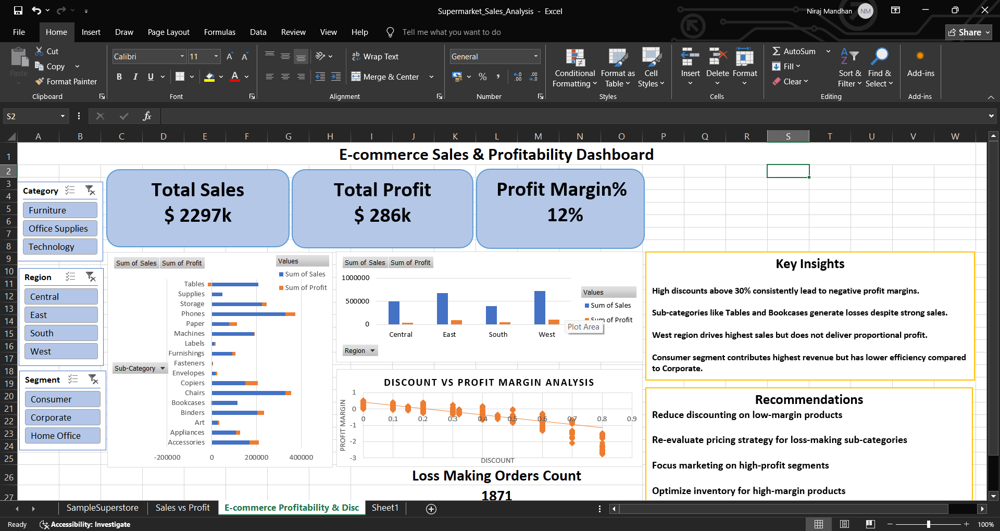

# Ecommerce_Sales_analysis

## Objective
Analyze e-commerce sales data to identify revenue trends, top-performing products, and customer purchasing behavior.
# Sales Data Analysis Project

## Tools Used
- Excel
- Python (Pandas, Matplotlib)

## Key Insights
- Monthly sales trends
- Top-performing categories
- Profit margin analysis

## Dashboard Preview

## Python Analysis

## Outcome
Helped understand sales patterns and improve strategy decisions.

